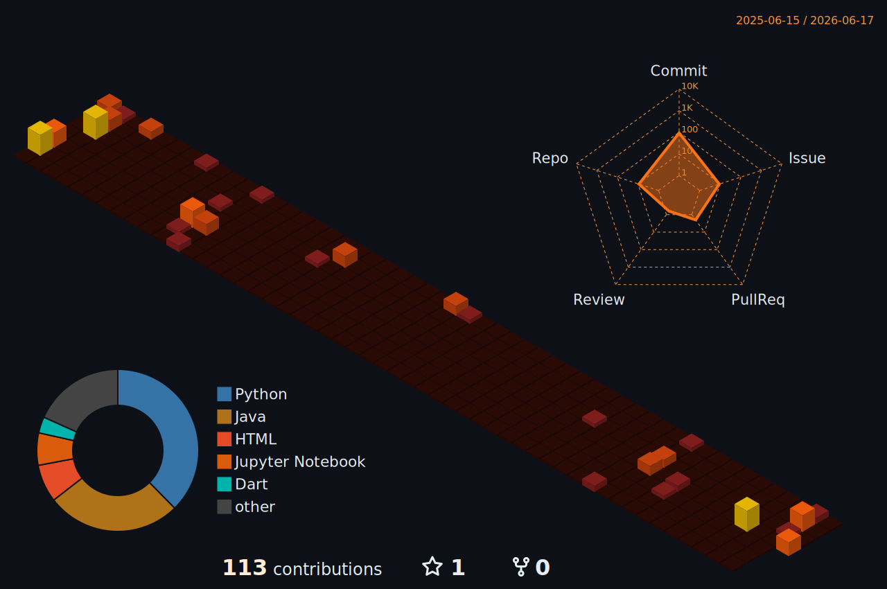

  

  
  
  

  
  
  

---

## Sobre mim

<table>
<tr>
<td width="34%" valign="top">
  
</td>
<td width="50%" valign="top">

Oi, sou Thiago.

Trabalho na intersecção entre engenharia analítica, engenharia de dados e ciência de dados.

Tenho experiência em pipelines ELT e ETL, modelagem dimensional (Kimball), orquestração com Airflow e transformações com dbt — com ênfase em engenharia analítica: construir camadas de dados confiáveis, documentadas e orientadas a perguntas reais de negócio. Em ciência de dados, domino manipulação e análise com Pandas e Polars, visualização com Matplotlib, Seaborn e Plotly e modelagem preditiva com scikit-learn. Trago para os projetos de dados uma visão de engenharia de software: design de APIs, contratos explícitos entre camadas e boas práticas de arquitetura.

</td>
</tr>
</table>

---

## Arsenal Técnico

  
  
   
  
  
  
  
  
  
  

<table>
<tr>
<td width="33%" valign="top">
<strong>Engenharia de Dados</strong> 
Pipelines ELT, arquitetura medallion, modelagem dimensional Kimball, dbt Core, Airflow e Streamlit.
</td>
<td width="33%" valign="top">
<strong>Ciência de Dados</strong> 
Manipulação e análise com Pandas e Polars, visualização com Matplotlib, Seaborn e Plotly e modelagem preditiva com scikit-learn.
</td>
<td width="33%" valign="top">
<strong>Infraestrutura & Cloud</strong> 
Docker containerização, serviços AWS para dados (armazenamento, processamento e orquestração em nuvem) e deploy de aplicações e bancos na nuvem.
</td>
</tr>
</table>

---

## Conecte-se

  
  
  

> Pipelines merecem a mesma disciplina de design que sistemas backend: contratos limpos entre camadas, responsabilidade única, tipos que nunca mentem.

---

## GitHub Stats

  

---

  

  <strong>Modelando o útil. Engenheirando o confiável. Entregando o que importa.</strong>

